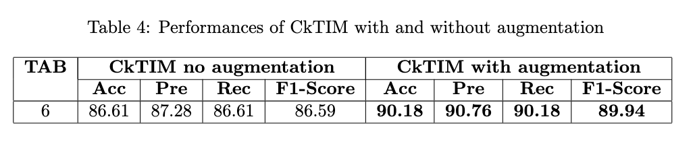

# **C**ontinuous **k**ernel **T**emporal-aware b**I**-direction **M**ulti-scale **net**work (CkTIM-net) for **Speech Emotion Recognition**


**Speech Emotion Recognition** (SER) is the task that consists in automatically recognise the human emotion by voice signal. This task plays a fundamental role in Machine Learning because of the growing importance of **HRI (Human Robot Interaction)**, in which we want algorithm that permits to the robot to recognise emotions and **improving communication with humans**. 

A lot of deep learning architectures improve performances in this task: as an example TIM-net [1] that is a novel temporal emotional modeling approach to learn multi-scale contextual affective representations from various time scale. 

An interesting approach for convolutions is the Continuous Kernel Convolutions (CkConv) for sequential data [2], that permits to handles arbitrarily long sequences, solving the problem that standard Convolutional neural networks have, because they cannot handle sequences of unknown size and their memory horizon must be defined a priori.

Our idea was to implement CkConv inside the TIM-net (both on Temporal Aware Blocks substituting the Dilated Convolutions and in the input substituting the Poinwise Convolutions) to decrease the depth of the network using less Temporal Aware Blocks (TABs), permitting to enlarge the receptive field also with a very less numbers of TABs in the network.

The resulting network is:


## INSTALLATION

1. Clone the repository:  
 ```sh 
 git clone "https://github.com/cybernetic-m/nn-project.git"
 cd nn-project 
 ```
2. Create a virtual environment:  
 ```sh 
 python -m venv myvenv
 ```
3. Activate virtual environments
 
 (On Windows):  
 ```sh 
 myvenv\Scripts\activate
 ```

 (On MacOS and Linux):  
 ```sh 
 source myvenv/bin/activate
 ```

4. Install requirements
 ```sh 
 pip install -r requirements.txt
 ```


## USAGE
There are three python notebooks:

1. '*notebook_train.ipynb*' : in this notebook you can train the model with different configurations.
2. '*notebook_test.ipynb*' : in this notebook you can test the model trained before
3. '*notebook_results.ipynb*' : in this notebook you can read our results

### Training
For the training you SHOULD:

1. #### Change '*config.yaml*' file:

To initialize the model hyperparameters and the training hyperparameters you SHOULD change the config.yaml file in '*/conf/config.yaml*' directory.

2. #### Run:

  You can run all the notebook to do the training both in '*local*' and in '*colab*', the code automatically recognise it.

  If you are in '*local*' the code automatically recognise what type of device you are using. The supported device are:
  
  - '*cuda*': Nvidia GPUs

  - '*mps*': Apple Silicon GPUs (M1, M2 ...)

  - '*cpu*': No GPUs

3. #### Results:

Train the model in the configuration chosen by '*config.yaml*' file and generate a directory in '*./training/results*' with:

  -  '*model.pt*' file: weights of the model trained (to use in notebook_test.ipynb for testing)

  -  '*training_metrics.json*': save the metrics (loss, accuracy, precision...) in training set

  -  '*validation_metrics.json*': save the metrics (loss, accuracy, precision...) in validation set

  -  '*parameters.txt*': save the configuration of the '*config.yaml*' file

### Test

To test the model you need:

1. #### Initialization:

 - "*actual_dir*": it's the path where there is the model.pt that you want to test (make sure that in the folder you have "model.pt" file of the model that you want to test, "training_metrics.json" and "validation_metrics.json" files to generate the plot of Loss and Accuracy).

 - "*AF_TYPE*": you can choose the activation function type depending on the model that you want to test

 - "*HIDDEN_SCALE*": you can choose the hidden scaling factor of Ck blocks depending on the model that you want to test

 - "*N_TAB*": you can choose the number of Temporal Aware Block depending on the model that you want to test

 - "*OMEGA_0*": you can choose the value of omega_0 of the sine activation function of CkConv depending on the model that you want to test 

There are others parameters that automatically initialize based on the name of the directory where there is the model that you want to test.
Make sure that your directory name is something of this type:

Ex. '*CkTIM_aug*' (Augmentation, conv kernel generator), '*CkkTIM*' (No augmentation, convKan kernel generator) ...

2. #### Automatic parameters initialization:

  - "*GEN_TYPE*": you can choose the Continuous Convolutional Kernel generator type choosing "*Ckk*" for '*convKan*' of "*Ck*" for '*conv*' in the name of the directory

  - "*CK*": it can be True (if in dir name there is 'Ck..' word) if you want to use Continuous Convolutions, or False if you want to test TIM-net

  - "*AUG*": it can be True (if in dir name there is'.._aug..') if you want to test your model (trained with augmentation) with augmented data, otherwise False

3. #### Result 

  - Saving "*name_test_metrics.json*" file with performances in test set of the selected model (accuracy, precision, ...)
  
  - Generate two plots:

    - Loss and Accuracy on Training and Validation of the selected model

    - Confusion Matrix on Test Set of the selected model

## RESULTS

In this section we comment the results. All the trials are done with the following setting:

1. *Training hyperparameters*

  - *num_epochs*: **100**
  - *batch_size*: **64**
  - *learning_rate*: **0.01**
  - *optimizer*: **adam**
  - *patience*: **5**
  - *lr_scheduler*: **0.25**
  - *label_smoothing*: **0.1**

2. *Model hyperparameters*

  - *dropout_rate*: **0.1**
  - *n_filter*: **39**
  - *num_features*: **39**
  - *generator_type*: **conv**
  - *kernel_size*: **2**
  - *hidden_scale*: **1**
  - *af_type*: **sin**

In particular we have done the following trials:

- *omega_0 trials*: firstly we tried different values of omega_0 for the sine activaction function of CkConv, finding that the best value is 25, used in all the following experiments.

- *TAB Trials*: we have tested CkTIM and TIM networks without augmentation with different numbers of TAB, this to see if Continuous Kernels can enlarge the receptive field of the network. Substantially we have decreased the depth (number of TABs) using CkConv blocks and increasing performances with respect to Dilated Convolutions.

- *Augmentation Trials*: we have tested CkTIM network with TAB=6 (the better case of previous trials) without and with augmentation, to see how augmentation increase performances

### Omega_0 Trials

Firstly we have tested the CkTIM with af_type = 'sine', trying different value of omega_0 hyperparameter of the activation function. We have found that omega_0 = 25 is the best value for this task. The number of TAB = 6 for these trials.

- *Upper Left*: Training Loss for CkTIM-net (TAB=6) with omega_0 = 24, 25, 26 
- *Upper Right*: Training Loss Zoom (from epoch 50 to 100) for CkTIM-net (TAB=6) with omega_0 = 24, 25, 26 
- *Bottom Left*:  Training Accuracy for CkTIM-net (TAB=6) with omega_0 = 24, 25, 26
- *Bottom Right*: Training Accuracy Zoom (from epoch 50 to 100) for CkTIM-net (TAB=6) with omega_0 = 24, 25, 26


- **Upper plots**: it's possible to see that omega_0 = 25 is in the middle between omega_0=24,26 also in the case of loss values (increasing omega_0 will let to less values in loss).

- **Bottom plots**: it's possible to see that omega_0=25 reach the highest value of training accuracy. We have selected this value for this reason, but to avoid overfitting phenomenon we have tested through "test" set (new samples different from training) all the CkTIM with different omega_0.

### TAB trials

In this section there are 4 plots:

- *Upper Left*: Training Loss for CkTIM-net with TAB = 1, 3, 6 
- *Upper Right*: Training Loss Zoom (from epoch 50 to 100) for CkTIM-net with TAB = 1, 3, 6 
- *Bottom Left*: Training Accuracy for CkTIM-net with TAB = 1, 3, 6 
- *Bottom Right*: Training Accuracy Zoom (from epoch 50 to 100) for CkTIM-net with TAB = 1, 3, 6


- **Upper plots**: it's possible to see that on one hand incresing the number of TAB modules in CkTIM will means starting from very high values of loss (more than TIM-net as we can see in next section, because the number of trainable parameters of CkTIM is higher), but on the other hand the loss converge to smallest values.
 
- **Bottom plots**: it's possible to see that the training accuracy is not influenced a lot by the number of TABs blocks (differently from TIM-net in next section where the differences in accuracy among TABs are higher), and this means that the Continuous Convolutional Kernel also with only 1 Temporal Aware Block enlarge the receptive fields.


### Augmentation Trials

In this plots it's possible to see how augmentation increase performances. 

In particular we have trained CkTIM with TAB=6 with the augmented dataset, to compare with CkTIM (TAB=6) trained with the original dataset. 


- **Left plot**: it's possible to see how augmentation permits the loss to converge in less epochs to the minimum value. 

- **Right plot**: it's possible to see that augmentation increses the accuracy of the model, permits a better generalization


### Metrics

The results are in the following table, where it can possible to see that omega_0=25 is confirmed as the best value also in the test case:


In the first table we can see that increasing the number of TABs let to increase performances in terms of Accuracy, Precision, Recall and F1-Score in both architectures, but generally CkTIM perform better then TIM for each TAB. For example CkTIM with only TAB=1 perform better then TIM with TAB=3.


In this table it's possible to see that on the other hand CkTIM have more trainable parameters then TIM for each TAB level, i.e. more weight of the model and more inference time.


In this table it's possible to see how augmentation increase performances in the better case of CkTIM with TAB=6.



### Confusion Matrix

In this section we'll comment the confusion matrix in the case of CkTIM and TIM with TAB=6 without augmentation, and the CkTIM with TAB=6 with augmentation.


In particular it's possible to notice also visually that the augmentation technique improves classification performances for "paura" and "rabbia" classes (16/16 correct classification). The CkTIM augmented perform well in this discriminative task, but have still difficulty in discriminate "paura" and "tristezza", "sorpresa" and "gioia", that are similar emotions!


## Authors
Massimo Romano (2043836) (https://github.com/cybernetic-m) 

Paolo Renzi (1887793) (https://github.com/RenziPaolo)

## References

[1] [TEMPORAL MODELING MATTERS: A NOVEL TEMPORAL EMOTIONAL MODELING
APPROACH FOR SPEECH EMOTION RECOGNITION](https://arxiv.org/pdf/2211.08233)

[2] [CKCONV: CONTINUOUS KERNEL CONVOLUTION FOR
SEQUENTIAL DATA](https://arxiv.org/pdf/2102.02611)


